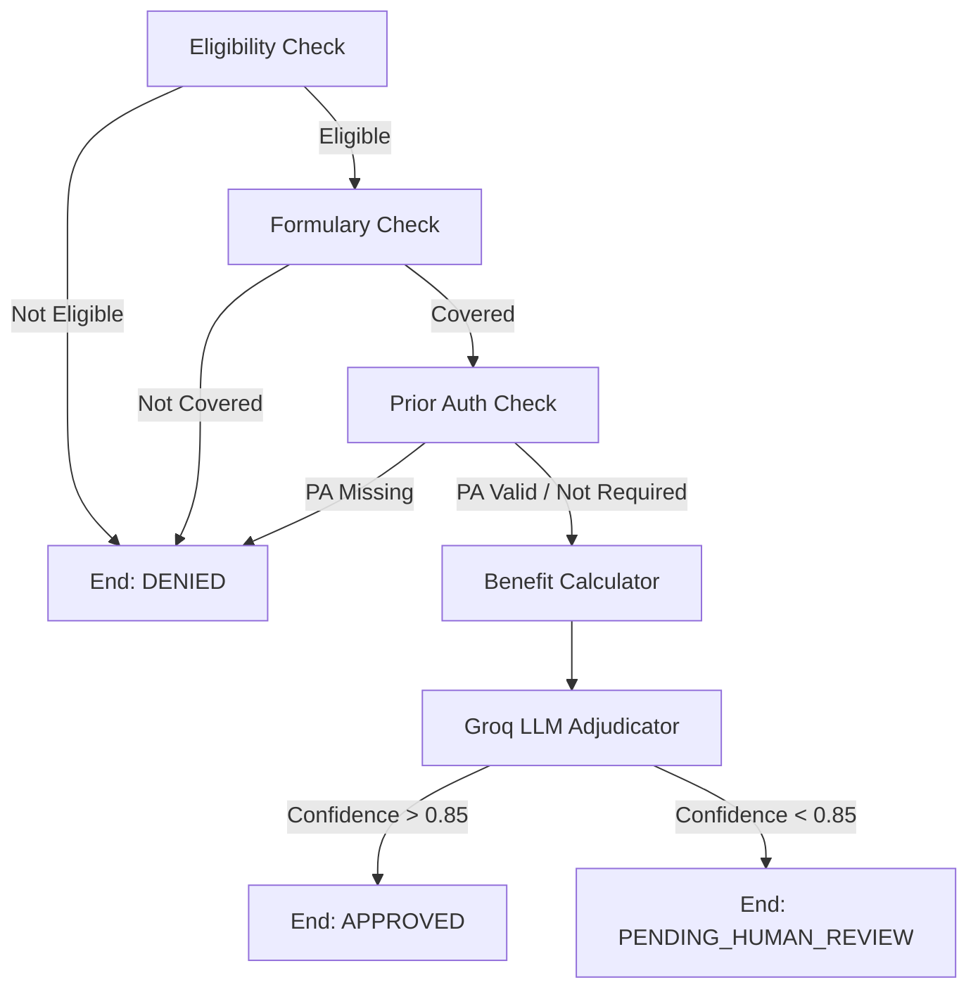

# Claims Adjudication Agent

A LangGraph multi-step agentic workflow processing pharmacy claims end-to-end with Human-In-The-Loop routing.

## Architecture

This project is built using a modern, free-tier-friendly hybrid stack:
- **Frontend**: React + Vite + TailwindCSS (Deployed on Vercel)
- **Backend**: FastAPI + LangGraph + Groq Llama 3.1 70B (Deployed on Render)
- **Database**: Supabase PostgreSQL

### LangGraph State Machine


*(ASCII representation below for environments without Mermaid support)*
```text
[Eligibility Check] -> [Formulary Check] -> [Prior Auth Check] -> [Benefit Calc] -> [Groq Adjudicate] -> APPROVED
       |                    |                    |                                       |
       v                    v                    v                                       v
    DENIED               DENIED               DENIED                           PENDING_HUMAN_REVIEW
```

## Human-In-The-Loop (HITL) Pattern

The system embraces a "Human-In-The-Loop" architecture. Claims that pass all deterministic checks (eligibility, formulary, PA) are passed to the Groq LLM Adjudicator. 

If the LLM's confidence score drops below `0.85` or the reasoning is ambiguous, the claim is not automatically approved or denied. Instead, it is routed to `PENDING_HUMAN_REVIEW`. These claims appear in the Reviewer Dashboard on the frontend, where a human adjudicator can review the AI's exact reasoning trace and manually Approve or Reject the claim.

## Setup Instructions

### 1. Database Setup (Supabase)
1. Create a new Supabase project.
2. Go to the SQL Editor and run the SQL provided in the project brief to create the `members`, `drugs`, `claims`, and `review_queue` tables.
3. Grab your `Project URL` and `service_role` secret from Project Settings -> API.

### 2. Backend Setup
```bash
cd backend
python -m venv venv
source venv/bin/activate  # On Windows: venv\Scripts\activate
pip install -r requirements.txt
```
Copy `.env.example` to `.env` and fill in your keys:
```
GROQ_API_KEY=your_key
SUPABASE_URL=your_url
SUPABASE_SERVICE_ROLE_KEY=your_key
```
Run the seed script once to populate data:
```bash
python database/seed.py
```
Start the server:
```bash
uvicorn main:app --reload
```

### 3. Frontend Setup
```bash
cd frontend
npm install
```
Create a `.env.local` file in the frontend folder:
```
VITE_API_URL=http://localhost:8000
```
Start the frontend:
```bash
npm run dev
```

## Demo Scenarios

Test the agent with these synthetic scenarios based on the seeded database:

| Scenario | member_id | drug_ndc | Expected |
|----------|-----------|----------|----------|
| Happy path | MBR-0000001 | NDC-ATORVA-40 | APPROVED |
| Expired member | MBR-9999999 | NDC-ATORVA-40 | DENIED: Not Eligible |
| PA required drug | MBR-0000001 | NDC-HUMIRA-40 | DENIED: PA Required |
| Low confidence | MBR-0000002 | NDC-UNKNOWN-01 | PENDING_HUMAN_REVIEW |

## Sample API cURL Commands

**Submit a Claim:**
```bash
curl -X POST http://localhost:8000/api/claims/process \
  -H "Content-Type: application/json" \
  -d '{
    "claim_id": "CLM-12345",
    "member_id": "MBR-0000001",
    "drug_ndc": "NDC-ATORVA-40",
    "drug_name": "Atorvastatin 40mg",
    "prescriber_npi": "NPI-123456",
    "quantity": 30,
    "days_supply": 30,
    "diagnosis_code": "E78.5"
  }'
```

**Fetch Pending Reviews:**
```bash
curl -X GET http://localhost:8000/api/dashboard/pending
```

## Deployment Steps

1. **GitHub**: Push this entire repository to GitHub.
2. **Backend (Render)**: 
   - Connect Render to your GitHub repo.
   - It will automatically read the `render.yaml` file.
   - Add your Environment Variables (`SUPABASE_URL`, `SUPABASE_SERVICE_ROLE_KEY`, `GROQ_API_KEY`) in the Render dashboard.
3. **Frontend (Vercel)**:
   - Import your GitHub repo into Vercel.
   - Set the Root Directory to `frontend`.
   - Add `VITE_API_URL` to the Environment Variables, pointing to your Render backend URL (e.g., `https://your-app.onrender.com`).
